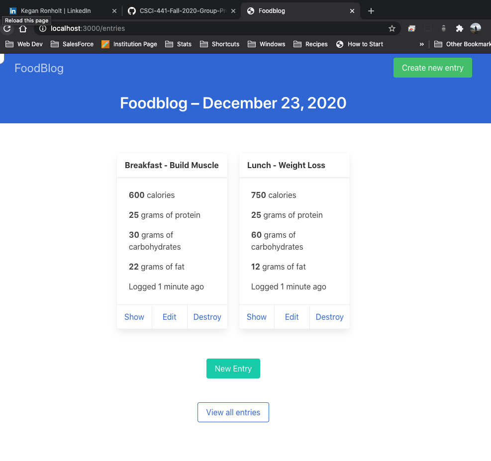

# README

This software was created to allow users to record their meals and make wise dietary decisions. Foodblog was developed in Ruby, HTML, and Bulma.  

Below is the dashboard for the application. From the dashboard, users have basic CRUD operations on the entry object.

Pictured below is the "New Entry" form. This form allows for the entering of new meals.

If a user makes a mistake with an Entry, they may click the "edit" button. The "Editing Entry" form allows the user to update an Entry object. 

The archive displays all of their entries for each day. This feature shows the total count of calories, proteins, carbs, and fats consumed.

